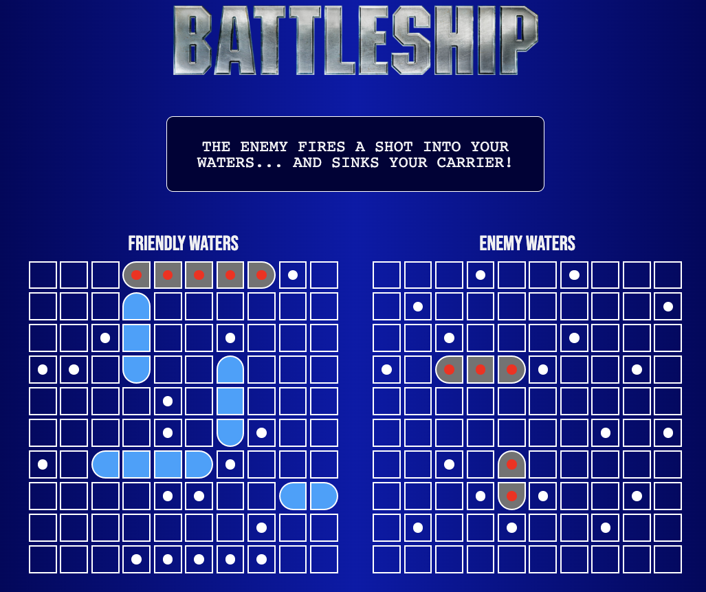

# Battleship

## Overview

My take on the classic strategy guessing game. Enter player name, position your ships, and battle the computer to see who will rule the high seas. First player to sink all of the opponent's ships wins!

[Live Demo]()

## Learning Objectives

- Practice writing unit tests
- Working with Jest test runner
- Introduction to Test Driven Development

## Notes

Initially started this project with the test-first approach in mind. However, as I started to build out the application I eventually found it difficult to maintain this approach. I believe, additional planning ahead of time will help.

Nevertheless, the different tests did aid during refactoring and contributed to better understanding and better code.

## Possible Improvements

- Add ship images and sounds. Several ship images and sound assets are saved but not currently used. In the future, may add ship images and sound effects.
- Add further effects such as animations for a missed/hit shot
- Add a two player mode
- Code can always be improved

## Helpful Links

- [Battleship wiki](<https://en.wikipedia.org/wiki/Battleship_(game)>)

## Credits

- Design inspired by and assets from [fortypercenttitaium](https://github.com/fortypercenttitanium). All logic and code is original.
